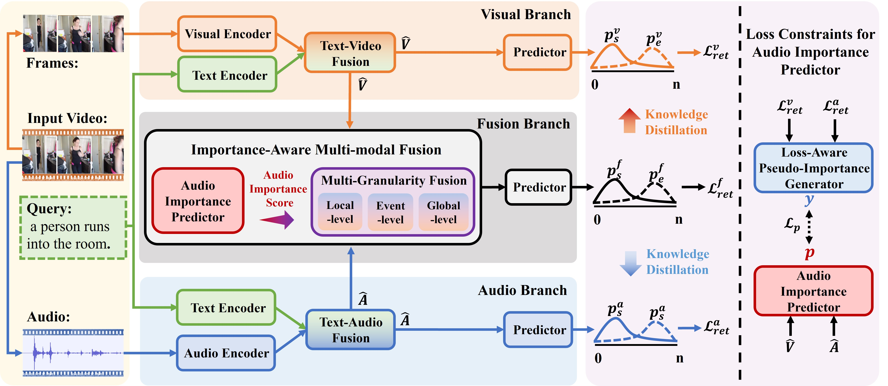

<h1 align="center">Audio Does Matter: Importance-Aware Multi-Granularity Fusion for Video Moment Retrieval</h1>

Repo for ACM MM'25 paper "*Audio Does Matter: Importance-Aware Multi-Granularity Fusion for Video Moment Retrieval*". This paper proposes solutions for the Video Moment Retrieval task from an audio-visual collaborative perspective.


You can find our pre-print paper from [arxiv](https://arxiv.org/abs/2508.04273).




## Table of Contents

* [Environments](#Set-up-the-Environment)
* [Data](#Data-Preparation)
* [Training](#Training)
* [Inference](#Inference)
* [Acknowledgement](#Acknowledgement)
* [Acknowledgement](#Citation-💖)


## Set up the Environment

* **Ubuntu 20.04**
* **CUDA 12.0**
* **Python 3.7**
* **torch 1.13.1**
* **torchvision 0.7.0**

Use Anaconda and easily build up the required environment by

```bash
cd IMG
conda env create -f env.yml
```

## Data Preparation

Follow previous work [ADPN](https://github.com/hlchen23/ADPN-MM), we use GloVe-840B-300d for text embeddings, I3D/CLIP+SF/InternVideo2 visual features and PANNs audio features for Charades-STA dataset, and I3D visual features and VGGish audio features for ActivityNet Captions dataset. 

We have also prepared CLIP + SlowFast and InternVideo2 features, CLIP features are extracted by ourselves, SlowFast features is derived from [here](https://github.com/wjun0830/CGDETR), while InternVideo2 features is derived from [here](https://huggingface.co/cg1177). 

We already prepare all data below.

Download [here](https://drive.google.com/drive/folders/1yu9-7SFVUKCbO1dgMcODGdaE1mIBkDsC?usp=sharing) to get Charades-STA features and Activitynet-Caption's audio features and json files. 

Download [here](https://mega.nz/folder/gv93jDSI#U9Qf1ZuKdP8cIJj5sdK0bw) to get Activitynet-Captions i3d features and GloVe embeddings, touch `IMG/data/features`, and ensure the following directory structure.

```
|--data
|  |--dataset
|     |--activitynet
|     |     |--train_qid.json
|     |     |--val_1_qid.json
|     |     |--val_2_qid.json
|     |--charades
|     |     |--charades_sta_test_qid.txt
|     |     |--charades_sta_train_qid.txt
|     |     |--charades.json
|     |     |--charades_audiomatter_qid.txt
|     |     |--charades_sta_train_tvr_format.jsonl
|     |     |--charades_sta_test_tvr_format.jsonl
|     |     |--charades_audiomatter_test_tvr_format.jsonl
|  |--features
|     |--activitynet
|     |     |--audio
|     |     |     |--VGGish.pickle
|     |     |--i3d_video
|     |     |     |--feature_shapes.json
|     |     |     |--v___c8enCfzqw.npy
|     |     |     |--...(*.npy)
|     |--charades
|     |     |--audio
|     |     |     |--0A8CF.npy
|     |     |     |--...(*.npy)
|     |     |--i3d_video
|     |     |     |--feature_shapes.json
|     |     |     |--0A8CF.npy
|     |     |     |--...(*.npy)
|     |     |--clip_features
|     |     |     |--visual_features
|     |     |     |     |--0A8CF.npy
|     |     |     |     |--...(*.npy)
|     |     |     |--slowfast_features
|     |     |     |     |--0A8CF.npz
|     |     |     |     |--...(*.npz)
|     |     |     |--text_features
|     |     |     |     |--qid_0.npy
|     |     |     |     |--...(*.npy)
|     |     |--iv2_features
|     |     |     |--visual_features_6b
|     |     |     |     |--0A8CF.pt
|     |     |     |     |--...(*.pt)
|     |     |     |--llama2_txt
|     |     |     |     |--qid0.pt
|     |     |     |     |--...(*.pt)
```


## Training

```bash
python main.py --task <charades|activitynet|charadesAM> --mode train --gpu_idx <GPU INDEX>
```

## Inference


```bash
python main.py --task <charades|activitynet|charadesAM> --mode test --gpu_idx <GPU INDEX>
```

Change the config `model_name` in `main.py` to the model_name of `your checkpoint`.


## Acknowledgement

We follow the repo [ADPN](https://github.com/hlchen23/ADPN-MM) and [VSLNet](https://github.com/26hzhang/VSLNet) for the code-running framework to quickly implement our work. We appreciate these great jobs.

This work was supported by the Pioneer and Leading Goose R\&D Program of Zhejiang (No. 2024C01110), National Natural Science Foundation of China (No. 62472385), Young Elite Scientists Sponsorship Program by China Association for Science and Technology (No. 2022QNRC001), Public Welfare Technology Research Project of Zhejiang Province (No. LGF21F020010), Fundamental Research Funds for the Provincial Universities of Zhejiang (No. FR2402ZD) and Zhejiang Provincial High-Level Talent Special Support Program.

## Citation 💖

If you find MS-DETR useful for your project or research, welcome to 🌟 this repo

